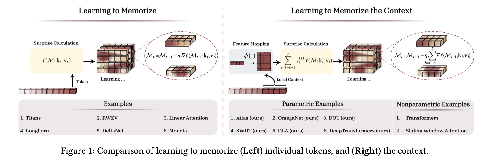
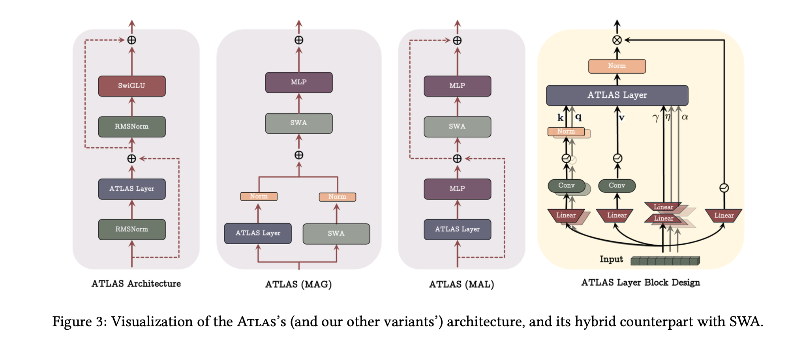

</img>

</img>

## Atlas - Pytorch

Unofficial implementation of [Atlas](https://arxiv.org/abs/2505.23735) in Pytorch.

## Usage

Install locally (this fork is not published to PyPI):

```bash
pip install -e .
pip install -e ".[examples]"
```

Basic memory usage:

```python
import torch
from atlas_pytorch import NeuralMemory

mem = NeuralMemory(
    dim = 384,
    chunk_size = 64
).cuda()

seq = torch.randn(2, 1024, 384).cuda()
retrieved, mem_state = mem(seq)
assert seq.shape == retrieved.shape
```

MAC transformer (Memory-As-Context):

```python
import torch
from atlas_pytorch import MemoryAsContextTransformer

transformer = MemoryAsContextTransformer(
    num_tokens = 256,
    dim = 256,
    depth = 2,
    segment_len = 128,
    num_persist_mem_tokens = 4,
    num_longterm_mem_tokens = 16,
)

ids = torch.randint(0, 256, (1, 1023))
loss = transformer(ids, return_loss = True)
loss.backward()

# after much training
sampled = transformer.sample(ids[:, :4], 512)
```

MAG transformer (Memory-As-Gate) with Atlas:

```python
import torch
from atlas_pytorch import MemoryAsGateTransformer

# MAG: sliding window attention + neural memory combined via gating
transformer = MemoryAsGateTransformer(
    num_tokens = 256,
    dim = 256,
    depth = 4,
    window_size = 64,
    num_persist_mem_tokens = 4,
    neural_memory_layers = (1, 2, 3, 4),
    # Atlas-specific options
    omega_window = 2,           # context window for Omega rule
    use_omega_gate = False,     # learned U gate
    poly_degree = 2,            # polynomial features
    poly_mode = 'elementwise',
    use_muon_optimizer = False, # Muon for memory updates
)

ids = torch.randint(0, 256, (1, 512))
loss = transformer(ids, return_loss = True)
loss.backward()

# sampling with cache
sampled = transformer.sample(ids[:, :4], 256, use_cache = True)
```

MAL transformer (Memory-As-Layer) with Atlas:

```python
import torch
from atlas_pytorch import MemoryAsLayerTransformer

# MAL: memory layer applied BEFORE attention
transformer = MemoryAsLayerTransformer(
    num_tokens = 256,
    dim = 256,
    depth = 4,
    window_size = 64,
    num_persist_mem_tokens = 4,
    neural_memory_layers = (1, 2, 3, 4),
    # Atlas-specific options
    omega_window = 2,
    use_omega_gate = False,
    poly_degree = 2,
    poly_mode = 'elementwise',
    use_muon_optimizer = False,
)

ids = torch.randint(0, 256, (1, 512))
loss = transformer(ids, return_loss = True)
loss.backward()

sampled = transformer.sample(ids[:, :4], 256, use_cache = True)
```

AtlasLMM (Pure Atlas - Long-term Memory only):

```python
import torch
from atlas_pytorch import AtlasLMM

# Pure memory model without attention
model = AtlasLMM(
    num_tokens = 256,
    dim = 256,
    depth = 4,
    num_persist_mem_tokens = 4,
    # Atlas-specific options
    omega_window = 2,
    use_omega_gate = False,
    poly_degree = 2,
    poly_mode = 'elementwise',
    use_muon_optimizer = False,
)

ids = torch.randint(0, 256, (1, 512))
loss = model(ids, return_loss = True)
loss.backward()

sampled = model.sample(ids[:, :4], 256, use_cache = True)
```

## Train (OmegaNet / Atlas)

This fork supports both OmegaNet (Omega rule with SGD) and Atlas (Omega + Muon) from the paper.

### MAC architecture (Memory-As-Context)

```bash
python train_mac.py --model omeganet --omega-window 2 --poly-mode elementwise --poly-degree 2
```

With Muon optimizer (Atlas):

```bash
python train_mac.py --model atlas --omega-window 2 --poly-mode elementwise --poly-degree 2
```

### MAG architecture (Memory-As-Gate)

```bash
python train_mag.py
```

Configure in script: `OMEGA_WINDOW`, `POLY_MODE`, `POLY_DEGREE`, `USE_MUON_OPTIMIZER`

### MAL architecture (Memory-As-Layer)

```bash
python train_mal.py
```

### AtlasLMM (Pure Memory Model)

```bash
python train_atlas.py
```

### Optional flags (for train_mac.py)

- `--use-omega-gate` to enable chunk-level U-gating
- `--poly-mode {off,elementwise,tensor}`
- `--poly-degree <int>`

### Polynomial features (`poly-mode`)

Atlas/OmegaNet can expand keys and queries with polynomial feature mappings to improve capacity and capture higher-order interactions:

- `off`: disables polynomial lifting; uses raw linear projections.
- `elementwise`: applies element-wise powers up to degree `g` and sums them, i.e. `x -> sum_{i=1..g} x^i`. This preserves the original dimensionality and is cheap (O(d)).
- `tensor`: builds degree‑2 interaction features via the outer product `x ⊗ x`, concatenates `[x, vec(x⊗x)]`, then applies a fixed, non‑trainable random projection back to the original dimension. For practicality, higher degrees fall back to degree‑2 interactions.

Why this design:

- Capacity: Polynomial lifting increases the effective input dimension, improving the number of key–value associations a fixed-size memory can store (see paper’s capacity bounds).
- Kernel view: Elementwise powers offer a Taylor‑like expansion that serves as a practical path towards richer kernels (e.g., approximating the exponential kernel behind softmax attention).
- Efficiency: `elementwise` adds minimal overhead; `tensor` captures pairwise interactions while controlling dimensional blow‑up via a fixed projection.

Implementation notes:

- The mapping is applied to keys (always) and to queries via a wrapper, so storage and retrieval share the same lifted space.
- The random projection in `tensor` mode is cached per device/dimension, non‑trainable, and keeps compute/memory bounded.
- Recommended defaults:
  - General: `--poly-mode elementwise --poly-degree 2`
  - For stronger interactions (more compute): `--poly-mode tensor`

## Tests

```bash
pytest -q tests/test_atlas.py
```

## Provenance / Attribution

This repository originates from the excellent Titans implementation by lucidrains and was adapted to strictly follow the paper-aligned MAC (Memory-As-Context) semantics, then extended with OmegaNet and Atlas options:

- Original project: [lucidrains/titans-pytorch](https://github.com/lucidrains/titans-pytorch)
- Paper-aligned MAC fixes (by Junyoung Park): committed-weights retrieval, segment-buffered inference queries, ephemeral context handling, and MAG/MAL/LMM architectural implementations aligned with Titans paper.
- Atlas extension (by Junyoung Park): Omega rule with sliding window, polynomial feature mappings (`poly-mode`), Muon toggle for Atlas, CLI for switching between `titans`/`omeganet`/`atlas`, and a comprehensive test suite for Omega/Atlas behavior.

This fork aims to provide a unified codebase for researching Titans and Atlas architectures with high fidelity to their respective papers.

## Citations

```bibtex
@inproceedings{Behrouz2024TitansLT,
    title   = {Titans: Learning to Memorize at Test Time},
    author  = {Ali Behrouz and Peilin Zhong and Vahab S. Mirrokni},
    year    = {2024},
    url     = {https://api.semanticscholar.org/CorpusID:275212078}
}
```

```bibtex
@article{Sun2024LearningT,
    title   = {Learning to (Learn at Test Time): RNNs with Expressive Hidden States},
    author  = {Yu Sun and Xinhao Li and Karan Dalal and Jiarui Xu and Arjun Vikram and Genghan Zhang and Yann Dubois and Xinlei Chen and Xiaolong Wang and Oluwasanmi Koyejo and Tatsunori Hashimoto and Carlos Guestrin},
    journal = {ArXiv},
    year    = {2024},
    volume  = {abs/2407.04620},
    url     = {https://api.semanticscholar.org/CorpusID:271039606}
}
```

```bibtex
@inproceedings{Yang2024GatedDN,
    title   = {Gated Delta Networks: Improving Mamba2 with Delta Rule},
    author  = {Songlin Yang and Jan Kautz and Ali Hatamizadeh},
    year    = {2024},
    url     = {https://api.semanticscholar.org/CorpusID:274598177}
}
```

```bibtex
@inproceedings{Nguyen2024TurningUT,
    title   = {Turning Up the Heat: Min-p Sampling for Creative and Coherent LLM Outputs},
    author  = {Minh Nguyen and Andrew Baker and Clement Neo and Allen Roush and Andreas Kirsch and Ravid Shwartz-Ziv},
    year    = {2024},
    url     = {https://api.semanticscholar.org/CorpusID:270870613}
}
```

```bibtex
@article{Zhu2024HyperConnections,
    title   = {Hyper-Connections},
    author  = {Defa Zhu and Hongzhi Huang and Zihao Huang and Yutao Zeng and Yunyao Mao and Banggu Wu and Qiyang Min and Xun Zhou},
    journal = {ArXiv},
    year    = {2024},
    volume  = {abs/2409.19606},
    url     = {https://api.semanticscholar.org/CorpusID:272987528}
}
```

```bibtex
@article{Zhou2024ValueRL,
    title   = {Value Residual Learning For Alleviating Attention Concentration In Transformers},
    author  = {Zhanchao Zhou and Tianyi Wu and Zhiyun Jiang and Zhenzhong Lan},
    journal = {ArXiv},
    year    = {2024},
    volume  = {abs/2410.17897},
    url     = {https://api.semanticscholar.org/CorpusID:273532030}
}
```

```bibtex
@software{Kyrylov_Accelerated_Scan_2024,
    author  = {Kyrylov, Volodymyr},
    doi     = {10.5281/zenodo.10600962},
    title   = {Accelerated Scan},
    version = {0.1.2},
    year    = {2024}
}
```

```bibtex
@misc{wang2025testtimeregressionunifyingframework,
    title   = {Test-time regression: a unifying framework for designing sequence models with associative memory},
    author  = {Ke Alexander Wang and Jiaxin Shi and Emily B. Fox},
    year    = {2025},
    eprint  = {2501.12352},
    archivePrefix = {arXiv},
    primaryClass = {cs.LG},
    url     = {https://arxiv.org/abs/2501.12352},
}
```

```bibtex
@misc{jordan2024muon,
    author  = {Keller Jordan and Yuchen Jin and Vlado Boza and Jiacheng You and
                    Franz Cesista and Laker Newhouse and Jeremy Bernstein},
    title   = {Muon: An optimizer for hidden layers in neural networks},
    year    = {2024},
    url     = {https://kellerjordan.github.io/posts/muon/}
}
```

```bibtex
@inproceedings{Zhang2025TestTimeTD,
    title   = {Test-Time Training Done Right},
    author  = {Tianyuan Zhang and Sai Bi and Yicong Hong and Kai Zhang and Fujun Luan and Songlin Yang and Kalyan Sunkavalli and William T. Freeman and Hao Tan},
    year    = {2025},
    url     = {https://api.semanticscholar.org/CorpusID:279071244}
}
```

```bibtex
@inproceedings{Behrouz2025ATLASLT,
    title  = {ATLAS: Learning to Optimally Memorize the Context at Test Time},
    author = {Ali Behrouz and Ze-Minghui Li and Praneeth Kacham and Majid Daliri and Yuan Deng and Peilin Zhong and Meisam Razaviyayn and Vahab S. Mirrokni},
    year   = {2025},
    url    = {https://api.semanticscholar.org/CorpusID:278996373}
}
```
